```{r setup, include=FALSE}
knitr::opts_chunk$set(
	echo = FALSE,
	message = FALSE,
	warning = FALSE,
	cache = FALSE,
	comment = NA,
	fig_caption = TRUE,
	prompt = TRUE,
	tidy.opts=list(width.cutoff=60),tidy=TRUE,
	fig.pos = 'H',
	fig.align = "center")
r = getOption("repos")
r["CRAN"] = "http://cran.us.r-project.org"
options(repos = r)

if(!(require(printr))) {
  install.packages(
    'printr',
    type = 'source',
    repos = c('http://yihui.name/xran', 'http://cran.rstudio.com')
  )
}
if (!requireNamespace("BiocManager", quietly = TRUE))
    install.packages("BiocManager")
BiocManager::install("GEOquery")
install.packages("colorspace")
install.packages("gplots")
install.packages("ggplot2")
install.packages("ggrepel")
install.packages("float")
BiocManager::install("oligo")
BiocManager::install("arrayQualityMetrics")
BiocManager::install("limma")
BiocManager::install("genefilter")
BiocManager::install("pvca")
BiocManager::install("annotate")
BiocManager::install("ReactomePA")
BiocManager::install("clusterProfiler")
```


# Resumen
El estudio escogido para el reanálisis es ["Expression data for C. elegans blunt force trauma"](https://www.ncbi.nlm.nih.gov/geo/query/acc.cgi?acc=GSE148325). El objetivo del estudio era averiguar si existen rutas diferenciales en individuos de edad diferente, como respuesta de defensa al aplicarles un estímulo de estrés traumático. Dado que los resultados aún no han sido publicados, se han guardado los resultados de las comparaciones entre todos los grupos de arrays, pero sólo se ha realizado un _"Gene Enrichment Analysis"_ a las comparaciones "sin/con lesión" de individuos del día 1, y "sin/con lesión" de individuos del día dos (esto es, UvsP1 y UvsP4). Se han seleccionado estas comparaciones por ser las que nos darán la información sobre las diferentes genes expresados para un mismo estímulo en los diferentes grupos de edad.


  Los resultados de este informe coinciden con los del experimento objeto de estudio. Indican que provocar estrés en *C. elegans* vía traumatismo activa rutas de transcripción distintivas y dependientes de edad.
  
  En caso de que se desee reproducir el análisis aquí realizado, el código R empleado se encuentra en el siguiente repositorio [**Github**](https://github.com/SoniaD89/ADO1).


```{r CreateFolders, warning=TRUE, include=FALSE}
#Activar chunk si se quiere replicar el experimento con los mismos directorios aquí empleados
setwd(".")
dir.create("data")
dir.create("results")
dir.create("figures")
```


# Introducción 

 _Caenorhabditis elegans_ es una especie de nematodo comúnmente utilizada como organismo modelo en estudios génicos. En el experimento se estudia la respuesta del organismo frente a estrés mecánico debido a traumatismos, y su relación con la edad del mismo. Es decir, se investigó si un traumatismo induce un programa transcripcional específico y dependiente de la edad. Para ello, se sometió a pruebas muestras de individuos de 1 día y 4 días de edad, a los cuales se les suministró el tratamiento (lesión, 4 lesiones o control). Al cabo de una hora fueron recolectados para procesar su ARN. 
 
 Este estudio muestra los resultados de un "Gene Enrichment Analysis", para ser utilizados en la investigación sobre mecanismos de respuesta a estrés diferenciales dependientes de edad en _C. elegans_. 


# Métodos

  Para el estudio se utilizó el chip de Affymetrix para la especie *C.elegans* (*high density oligonucleotide array*)( material de soporte disponible [online](http://www.affymetrix.com/support/technical/byproduct.affx?product=celegans)), dando como resultado el dataset _GSE148325_ . Dicho dataset ha sido analizado para este ejercicio mediante el software [R](https://cran.r-project.org/index.html) y Bioconductor(https://www.bioconductor.org/). El código utilizado para este informe se encuentra en el siguiente repositorio [GitHub] (https://github.com/SoniaD89/ADO1). 

```{r include=FALSE}
library(GEOquery)
gds <- getGEO("GSE148325")
#Creo archivo targets
targets<-write.csv((gds[["GSE148325_series_matrix.txt.gz"]]@phenoData@data), "data/targets.csv",col.names = TRUE)
```


## Tratamiento de los datos

  Para comenzar el nuevo análisis, se obtuvo el dataset [_GSE148325_](https://www.ncbi.nlm.nih.gov/geo/download/?acc=GSE148325) de la base de datos GEO, se leyeron los archivos .CEL del mismo y se procedió a la creación de un archivo llamado *targets* para contener en él todas las variables a analizar. A este archivo, se le añadió la variable `grupo` para facilitar el análisis, donde 1U señala los individuos de 1 día de edad sin lesión provocada (*uninjured*, U), 1P para individuos de la misma edad pero lesionados (*paralyzed*, P), 4U para individuos de 4 días sin lesión, 4P si se lesionaron y 4U4P si esa lesión fue repetida cuatro veces. 
  
  
```{r ReadTargets, echo=FALSE}
#leo archivo targets, y añado variable grupo. Factorizo variable grupo.
targets <- read.csv2("./data/targets.csv", header = TRUE, sep = ",") 
targets$grupo <-c(rep("1U",3),rep("1P",3),rep("4U",3),rep("4P",3),rep("4P4P",3))
grupo <- as.factor(targets$grupo)
```

```{r ReadCELfiles, message=FALSE, warning=FALSE, include=FALSE, results='hide'}
require(oligo)
celFiles <- list.celfiles("./data", full.names = TRUE)
require(Biobase)
my.targets <-read.AnnotatedDataFrame(file.path("./data/targets.csv"), 
                                     header = TRUE, row.names = 1, 
                                     sep=";") 
rawData <- read.celfiles(celFiles, phenoData = my.targets)
```


  La calidad de estos datos sin tratar ha sido analizada mediante la función `arrayQualityMetrics`. Una vez comprobado que los datos son viables, se realizó un análisis de componentes principales, cuyo resultado puede verse en la Figura  \@ref(fig:PCARaw) y se visualizó la variabilidad de intensidad de estos arrays mediante un boxplot (Figura \@ref(fig:BoxplotRaw) ).

```{r QCRaw, message=FALSE, warning=FALSE, include=FALSE}
require(arrayQualityMetrics)
arrayQualityMetrics(rawData, outdir = file.path("./results", "QCDir.Raw"), force=TRUE)
```  
  
```{r plotpca, include=FALSE}
library(ggplot2)
library(ggrepel)
plotPCA3 <- function (datos, labels, factor, title, scale,colores, size = 1.5, glineas = 0.25) {
  data <- prcomp(t(datos),scale=scale)
  # Ajustes del gráfico
  dataDf <- data.frame(data$x)
  Group <- factor
  loads <- round(data$sdev^2/sum(data$sdev^2)*100,1)
  # Función de gráfico
  p1 <- ggplot(dataDf,aes(x=PC1, y=PC2)) +
    theme_classic() +
    geom_hline(yintercept = 0, color = "gray70") +
    geom_vline(xintercept = 0, color = "gray70") +
    geom_point(aes(color = Group), alpha = 0.55, size = 3) +
    coord_cartesian(xlim = c(min(data$x[,1])-5,max(data$x[,1])+5)) +
    scale_fill_discrete(name = "Group")
  # Evitar superposición de etiquetas
  p1 + geom_text_repel(aes(y = PC2 + 0.25, label = labels),segment.size = 0.25, size = size) + 
    labs(x = c(paste("PC1",loads[1],"%")),y=c(paste("PC2",loads[2],"%"))) +  
    ggtitle(paste("PCA para: ",title,sep=" "))+ 
    theme(plot.title = element_text(hjust = 0.5)) +
    scale_color_manual(values=colores)
  }
```
```{r PCARawsave, message=FALSE, include=FALSE}
png("figures/PCARaw.png", width = 480, height = 480, res = 120)
plotPCA3(exprs(rawData), labels = targets$age.ch1, factor = grupo, 
         title="Datos sin tratar", scale = FALSE, size = 3, 
         colores = c("red", "blue", "green", "yellow","purple"))

dev.off()
```
```{r PCARaw, echo=FALSE, fig.cap="Principales Componentes en datos sin tratar ", message=FALSE, fig.align="center"}
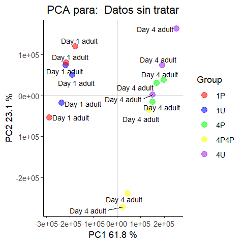
```

```{r BoxplotRawsave, fig.cap="Boxplot con datos sin tratar", message=FALSE, include=FALSE}
png("figures/BoxplotRaw.png", res = 150, width = 480, height = 480)

boxplot(rawData, cex.axis=0.5, cex.main= 0.5, which="all",
         col = c(rep("red", 3), rep("blue", 3), rep("green", 3), rep("yellow", 3),rep("purple",3)),
         main="Distribución de intensidades (datos sin tratar)")
dev.off()
```

```{r BoxplotRaw, echo=FALSE, fig.align="center", fig.cap="Boxplot con datos sin tratar", message=FALSE}
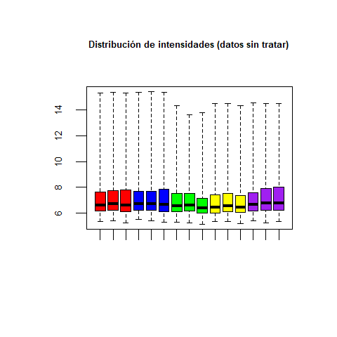
```


En el análisis de los componentes principales (PCA) se observa que el primer componente del PCA es responsable del 61.8% de la variabilidad de las muestras. Como puede verse en el gráfico de la figura \@ref(fig:PCARaw), esta variabilidad podría atribuirse ya a la edad, al estar los individuos de edades diferentes claramente separados (adultos de 4 días a la derecha, adultos de un día a la izquierda).

En la Figura \@ref(fig:BoxplotRaw) se comprueba que la distribución de intensidades de los arrays es similar para todas las muestras. 


```{r Normalizacion, include=FALSE}
eset_rma <- rma(rawData)
```
```{r QCNorm, message=FALSE, warning=FALSE, eval=FALSE}
library(arrayQualityMetrics)
arrayQualityMetrics(eset_rma, outdir = file.path("./results", "QCDir.Norm"), force=TRUE)
```


  Una vez realizados estos análisis, los datos se normalizaron y se repitieron tanto el análisis de calidad, como el análisis de los componentes principales (Figura \@ref(fig:PCANorm)) y la visualización de la variabilidad (Figura \@ref(fig:BoxplotNorm)).  
    
```{r PCANormsave, message=FALSE, warning=FALSE, include=FALSE}
png("figures/PCANorm.png", res = 150, width = 480, height = 480)

plotPCA3(exprs(eset_rma), labels = targets$grupo, factor = grupo, 
         title="Datos normalizados", scale = FALSE, size = 3, 
         colores = c("red", "blue", "green", "yellow","purple"))
dev.off()

```
```{r PCANorm, fig.cap="Visualización de los Componentes Principales en datos normalizados", fig.align="center"}
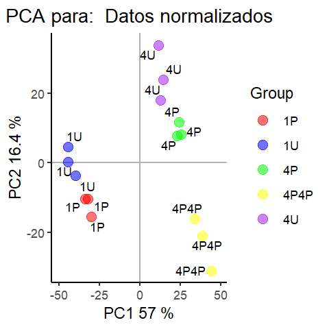
```

```{r BoxplotNormsave, message=FALSE, include=FALSE}
png("figures/BoxplotNorm.png", res = 150, width = 480, height = 480)
boxplot(eset_rma, cex.axis=0.5, cex.main = 0.5, which="all", 
         col = c(rep("red", 3), rep("blue", 3), rep("green", 3), rep("yellow", 3), rep("purple",3)),
         main="Boxplot para la intensidad de los arrays con datos normalizados")
dev.off()
```
```{r BoxplotNorm, echo=FALSE, fig.align="center", fig.cap="Distribución de las intensidades en datos normalizados", message=FALSE}
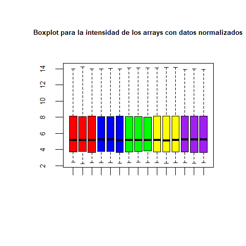
```
  
  En la figura \@ref(fig:PCANorm) se observa que la variabilidad debida al primer componente del análisis se ha reducido, pero aún se distingue la separación de los diferentes grupos de grupos de edad. En la figura \@ref(fig:BoxplotNorm) se reflejan las variabilidades de intensidades normalizadas, y se comprueba que la normalización se ha realizado correctamente al ser éstas muy similares para todas las muestras.


Con esos datos normalizados, se realizó un test pvca (*Principal Variation Component Analysis*) para eliminar efectos debidos a la manipulación de los arrays en el laboratorio, y representar en un gráfico hasta qué punto cada una de las variables (edad y tratamiento) son responsables de la variabilidad de los arrays (Figura \@ref(fig:plotPVCA)). Se observa que un 71,9% de la variabilidad entre muestras puede atribuirse a la variable edad `age.ch1`, mientras que sólo un 0,9% se debe a la interacción entre edad y grupo.


```{r BatchDetection, message=FALSE, warning=FALSE, include=FALSE}
#cargo librería pvca
library(pvca)
pData(eset_rma) <- targets
#selecciono umbral
pct_threshold <- 0.6
#selecciono factores a analizar
batch.factors <- c("age.ch1", "treatment.ch1")
#analizo: 
pvcaObj <- pvcaBatchAssess (eset_rma, batch.factors, pct_threshold)
```
```{r plotPVCAsave, fig.cap="Importancia relativa de los diferentes factores (edad temperatura e interacción entre ellos) que afectan a la expresión génica", include=FALSE}
png("figures/plotPVCA.png", res = 150, width = 400, height = 400)
#hago un gráfico con los resultados del análisis
bp <- barplot(pvcaObj$dat, xlab = "Efectos",
  ylab = "Proporción media de la varianza",
  ylim= c(0,1.1),col = c("red"), las=2,
  main="Estimación PVCA")
axis(1, at = bp, labels = pvcaObj$label, cex.axis = 0.25, las=2)
values = pvcaObj$dat
new_values = round(values , 3)
text(bp,pvcaObj$dat,labels = new_values, pos=3, cex = 0.5)
dev.off()

```
```{r plotPVCA, fig.cap="Importancia relativa de los diferentes factores (edad temperatura e interacción entre ellos) que afectan a la expresión génica", fig.align="center", echo=FALSE}
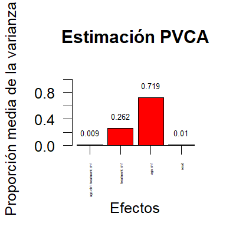
```

```{r Filtering1, message=FALSE, include=FALSE, results='hide'}
#INSTALO PAQUETE ANOTACION CELEGANS
library(genefilter)
library(celegans.db)
annotation(eset_rma) <- "celegans.db"
filtered <- nsFilter(eset_rma, 
                     require.entrez = TRUE, remove.dupEntrez = TRUE,
                     var.filter=TRUE, var.func=IQR, var.cutoff=0.75, 
                     filterByQuantile=TRUE, feature.exclude = "^AFFX")
eset_filtered <-filtered$eset
```

El siguiente paso fue realizar un gráfico mostranto la variabilidad de los genes en las muestras (Figura  \@ref(fig:SDplot)) ordenados de menor a mayor variabilidad. Los genes con una variabilidad atribuible al azar y no a expresiones diferenciales entre grupos fueron filtrados mediante la función `nsFilter` del paquete de Bioconductor `genefilter` y la anotación correspondiente a nuestro caso `celegans.db`. Con los `r dim(exprs(eset_filtered))[1]` genes que quedaron tras ese filtrado, se realizó una matriz de diseño para posteriormente realizar una matriz de contrastes. Esta matriz de contrastes muestra todas las comparaciones que se quieren realizar, en nuestro caso 1Uvs1P, 4Uvs4P y 4Pvs4P4P, además de la interacción entre el tratamiento y la edad de los individuos muestreados. Con estas comparaciones se puede observar no sólo si hay diferencias en las expresiones de dentro de los grupos muestrales de 1 día y 4 días según tratamiento y poder comprobar la interacción de la edad en la respuesta fisiológica de estudio, sino si hay diferencias entre muestras de individuos de la misma edad lesionados y sin lesionar. Se han añadido las comparaciones entre individuos con un mismo tratamiento pero diferente edad  (1Uvs4U y 1Pvs4P) para un posible estudio de diferencias debidas únicamente a la edad.  Las comparaciones que se usarán para el estudio de la significación biológica en este informe son 1Uvs1P, 4Uvs4P (desde ahora, UvsP1 y UvsP4 respectivamente) y la interacción entre ambas INT, ya que se entiende que el objetivo es saber la diferencia de las expresiones provocadas por la reacción a un traumatismo entre una edad y otra. Los resultados correspondientes al resto de comparaciones quedarán almacenados en caso de fuesen necesarios para un estudio posterior o futuras publicaciones. 

```{r SDplotsave, include=FALSE}
sds <- apply (exprs(eset_rma), 1, sd)
sdsO<- sort(sds)
png("figures/SDplot.png", res = 150, width = 480, height = 480)
sd <- plot(1:length(sdsO), sdsO, main="Distribución de la variabilidad de todos los genes",
     xlab="Genes (de menos a más variables)", ylab="Desviación estándar", cex.main=0.5, cex.lab=0.5)
abline(v=length(sds)*c(0.9,0.95))
dev.off()
```

```{r SDplot, echo=FALSE, fig.cap="Variabilidad de genes. Las líneas verticales representan los percentiles 90 y 95. Los genes están ordenados de menos a más variables"}
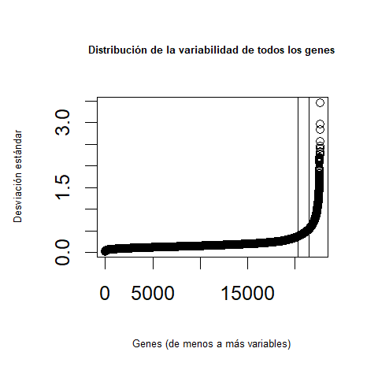
```

```{r SaveData1, message=FALSE, include=FALSE, results='hide'}
write.csv(exprs(eset_rma), file="./results/normalized.Data.csv")
write.csv(exprs(eset_filtered), file="./results/normalized.Filtered.Data.csv")
save(eset_rma, eset_filtered, file="./results/normalized.Data.Rda")
```
```{r LoadSavedData, include=FALSE}
if (!exists("eset_filtered")) load (file="./results/normalized.Data.Rda")
```

```{r DesignMatrix, message=FALSE, include=FALSE}
library(limma)
designMat<- model.matrix(~0+grupo, pData(eset_filtered))
colnames(designMat) <- c("Joven.sin", "Joven.con", "Viejo.sin", "Viejo.con", "Viejo.con4")
```


```{r setContrasts, include=FALSE}

cont.matrix <- makeContrasts (UvsP4= Viejo.sin - Viejo.con,
                              UvsP1= Joven.sin - Joven.con,
                              PvsPP4= Viejo.con - Viejo.con4,
                              U1vsU4= Joven.sin - Viejo.sin,
                              P1vsP4= Joven.con - Viejo.con,
                              INTedad = (Viejo.sin - Viejo.con) - (Joven.sin - Joven.con),
                              levels=designMat)
```

Una vez estas matrices han quedado definidas, se procede a estimar el modelo y estimar los contrastes, así como a realizar los tests de significancia adecuados. En este caso, se ha utilizado el paquete `limma`, que utiliza análisis de Bayes empírico para combinar una estimación de la variabilidad basada en la matriz completa con estimaciones individuales, basadas éstas en valores individuales, dando lugar así a estimaciones de error mejoradas [@Smyth2004]. Este análisis provee de estadísticos comunes como _Fold Change_ o _p-value_. Para intentar mitigar la aparición de falsos positivos, el p-valor se ajustó utilizando el método de Benjamini y Hochberg. 

```{r include=FALSE}
library(limma)
fit<-lmFit(eset_filtered, designMat)
fit.main<-contrasts.fit(fit, cont.matrix)
fit.main<-eBayes(fit.main)
```

## Expresión diferencial

```{r topTabs1, include=FALSE}
topTab_4<- topTable (fit.main, number=nrow(fit.main), coef="UvsP4", adjust="fdr")
```
```{r topTabs4, include=FALSE}
topTab_1 <- topTable (fit.main, number=nrow(fit.main), coef="UvsP1", adjust="fdr")
```
```{r topTabs3, include=FALSE}
topTab_4x4<- topTable (fit.main, number=nrow(fit.main), coef="PvsPP4", adjust="fdr") 
```
```{r topTabs5, include=FALSE}
topTab_INT  <- topTable (fit.main, number=nrow(fit.main), coef="INTedad", adjust="fdr") 
```
```{r topTabs6, include=FALSE}
topTab_U<- topTable (fit.main, number=nrow(fit.main), coef="U1vsU4", adjust="fdr")
```
```{r topTabs7, include=FALSE}
topTab_P<- topTable (fit.main, number=nrow(fit.main), coef="P1vsP4", adjust="fdr")
```

Para obtener una lista de los genes expresados diferencialmente, se ha utilizado la función `topTable` del ya mencionado paquete `limma`, para cada una de las comparaciones. Las listas ofrecen los genes ordenados de menor a mayor p-valor, lo que puede considerarse como de mayor a menor expresión diferencial. Dicha lista incluye también otros estadísticos como `logFC`(media de la diferencia entre grupos), `AveExpr` (expresión media de los genes en la comparación), `t`(estadístico tipo t-test para la comparación), el p-valor ajustado y el estadístico `B` (probabilidad logaritmica de que el gen esté diferencialmente expresado contra que no lo esté). Dado que en esta lista los genes vienen nombrados según el criterio del fabricante (en este caso, Affymetrix), el siguiente paso será el de la anotación de los genes. Se añadieron a los datos los identificadores de Entrez Gene y Gene Symbol. El paquete de anotación utilizado para ello ha sido `celegans.db`. 

```{r GeneAnnotation, message=FALSE, warning=FALSE, include=FALSE}
annotatedTopTable <- function(topTab, anotPackage)
{
  topTab <- cbind(PROBEID=rownames(topTab), topTab)
  myProbes <- rownames(topTab)
  thePackage <- eval(parse(text = anotPackage))
  geneAnots <- select(thePackage, myProbes, c("SYMBOL", "ENTREZID", "GENENAME"))
  annotatedTopTab<- merge(x=geneAnots, y=topTab, by.x="PROBEID", by.y="PROBEID")
return(annotatedTopTab)
}
```

```{r annotateTopTables, message=FALSE, warning=FALSE, include=FALSE}
topAnnotated_1 <- annotatedTopTable(topTab_1,
anotPackage="celegans.db")
topAnnotated_4 <- annotatedTopTable(topTab_4,
anotPackage="celegans.db")
topAnnotated_4x4 <- annotatedTopTable(topTab_4x4,
anotPackage="celegans.db")
topAnnotated_U <- annotatedTopTable(topTab_U,
anotPackage="celegans.db")
topAnnotated_P <- annotatedTopTable(topTab_P,
anotPackage="celegans.db")
topAnnotated_INT <- annotatedTopTable(topTab_INT,
anotPackage="celegans.db")
write.csv(topAnnotated_1, file="./results/topAnnotated_day1.csv")
write.csv(topAnnotated_4, file="./results/topAnnotated_day4.csv")
write.csv(topAnnotated_U, file="./results/topAnnotated_uninjured_both_ages.csv")
write.csv(topAnnotated_P, file="./results/topAnnotated_paralyzed_both_ages.csv")
write.csv(topAnnotated_4, file="./results/topAnnotated_day4.csv")
write.csv(topAnnotated_4x4, file="./results/topAnnotated_day4x4.csv")
write.csv(topAnnotated_INT, file="./results/topAnnotated_INT.csv")
```


Una vez tenemos los genes anotados, procedemos a la visualización de los resultados de la expresión diferencial obtenidos. En este informe se muestran varios ejemplos de visualización. Para mostrar una visión general de la expresión diferencial se realiza un `volcanoplot` para la comparación UvsP1  y otro para la comparación UvsP4 (Figura  \@ref(fig:volcanoplots)). Para ver cuántos genes han sido seleccionados en una o varias de las comparaciones, se obtiene una tabla mediante la función `decideTest`y se realiza un diagrama de Venn mediante la función `VennDiagram`(Figura  \@ref(fig:Venndiagram)). Para una visualización más detallada, se elaboraron dos mapas de calor(con y sin clustering) mediante la función `heatmap.2` (Figura  \@ref(fig:heatmapsin)  (Figura \@ref(fig:heatmapcon) del paquete `gplots`, en el que cada una de las columnas representa a un grupo muestral. Para elaborar este mapa se utilizaron los genes seleccionados en los pasos previos.


```{r Symbols, message=FALSE}
library(celegans.db)
geneSymbols <- select(celegans.db, rownames(fit.main), c("SYMBOL"))
SYMBOLS<- geneSymbols$SYMBOL
```
```{r Volcanoplots, include=FALSE, results='hide'}
png("figures/volcanoplot4.png", res = 80, width = 480, height = 480)
volcanoplot(fit.main, coef=1, highlight=4, names=SYMBOLS, 
            main=paste("Genes expresados diferencialmente", cex.main=0.5, colnames(cont.matrix)[1], sep="\n")) 
abline(v=c(-1,1))

dev.off()
png("figures/volcanoplot1.png", res = 80, width = 480, height = 480)
volcanoplot(fit.main, coef=2, highlight=4, names=SYMBOLS, 
            main=paste("Genes expresados diferencialmente", colnames(cont.matrix)[2], sep="\n")) 
abline(v=c(-1,1))
dev.off()

pdf("figures/Volcanos.pdf")
for (i in colnames(cont.matrix)){
  volcanoplot(fit.main, coef=i, highlight=4, names=SYMBOLS,
              main=paste("Genes expresados diferencialmente",i, sep="\n"))
  abline(v=c(-1,1))
}
dev.off()
```
```{r decideTests.1}
library(limma)
res<-decideTests(fit.main, method="separate", adjust.method="fdr", p.value=0.1, lfc=1)
```
```{r resumeDecideTests, include=FALSE}
sum.res.rows<-apply(abs(res),1,sum)
res.selected<-res[sum.res.rows!=0,] 
```
```{r venn, include=FALSE}
png("figures/vennDiagram.png", res = 150, width = 480, height = 480)
vennDiagram (res.selected[,1:3], cex=0.9)
title("Genes comunes entre UvsP1, UvsP4  y PvsPP4",cex.main=0.7)
dev.off()
```


```{r data4Heatmap, message=FALSE}
probesInHeatmap <- rownames(res.selected)
HMdata <- exprs(eset_filtered)[rownames(exprs(eset_filtered)) %in% probesInHeatmap,]

geneSymbols <- select(celegans.db, rownames(HMdata), c("SYMBOL"))
SYMBOLS<- geneSymbols$SYMBOL
rownames(HMdata) <- SYMBOLS
write.csv(HMdata, file = file.path("./results/data4Heatmap.csv"))
```
```{r message=FALSE, include=FALSE}
library(gplots)
```
```{r heatmapNoclustering, include=FALSE}
my_palette <- colorRampPalette(c("blue", "red"))(n = 299)
png("figures/heatmapNoclustering.png", res = 150, width = 5, height = 5, units = 'in')

heatmap.2(HMdata,
          Rowv = FALSE,
          Colv = FALSE,
          main = " \n FDR < 0,1, logFC >=1",
          scale = "row",
          col = my_palette,
          sepcolor = "white",
          sepwidth = c(0.05,0.05),
          cexRow = 0.5,
          cexCol = 0.9,
          key = TRUE,
          keysize = 1.5,
          density.info = "histogram",
          ColSideColors = c(rep("red",3),rep("purple", 3), rep("blue",3), rep("green",3), rep("yellow",3)),
          tracecol = NULL,
          dendrogram = "none",
          srtCol = 30)
dev.off()
```

```{r heatmapClustering, include=FALSE}
png("figures/heatmapClustering.png", res = 150, width = 5, height = 5, units = 'in')

heatmap.2(HMdata,
          Rowv = TRUE,
          Colv = TRUE,
          dendrogram = "both",
          main = "\n FDR < 0,1, logFC >=1",
          scale = "row",
          col = my_palette,
          sepcolor = "white",
          sepwidth = c(0.05,0.05),
          cexRow = 0.5,
          cexCol = 0.9,
          key = TRUE,
          keysize = 1.5,
          density.info = "histogram",
          ColSideColors = c(rep("red",3),rep("purple", 3), rep("blue",3), rep("green",3), rep("yellow",3)),
          tracecol = NULL,
          srtCol = 30)
dev.off()

```


## Importancia biológica

Por último, para ayudar a interpretar la importancia biológica de los resultados del experimento, se realizó un test `enrichgo` (`Gene  Enrichment Analysis`) [@clusterbook] mediante el paquete `clusterProfiler` [@clusterprofiler].  Para representar los resultados de este test, se han utilizado diagramas de barras mediante la función `barplot`, un diagrama en forma de red especificando qué genes son los que actúan mediante la función `cnetplot` y un gráfico `emapplot`, que pueden ayudar a la interpretación de los resultados aquí obtenidos.  Se han calculado los resultados para las ontologías `BP`(Biological Process), `CC`(Cellular Component) y `MF` (Molecular Function), para tener una visión más general de la importancia biológica de los resultados, pero aquí sólo se mostrarán los resultados correspondientes a `BP`al considerarse la ontología de interés.  El criterio de selección de genes diferencialmente expresados ha sido un p-valor ajustado menor de 0.05, salvo para el caso de `MF`, en el que se ha elevado ese valor a 0.15 para poder realizar el análisis y obtener resultados en todas las comparaciones. Se seleccionan todos los genes que tienen al menos una anotación en la base de datos GO. 


```{r selectGenes, include=FALSE}
listOfTables <- list(day1 = topTab_1, 
                     day4  = topTab_4, 
                     day4x4 = topTab_4x4,
                     U = topTab_U,
                     P = topTab_P,
                     INT = topTab_INT)
listOfSelected <- list()
library(clusterProfiler)
for (i in 1:length(listOfTables)){
  # Selecciono toptable
  topTab <- listOfTables[[i]]
  # selecciono los genes a ser añadidos en el análisis
  whichGenes<-topTab["adj.P.Val"]<0.01
  selectedIDs <- rownames(topTab)[whichGenes]
  # convert the ID to Entrez
  EntrezIDs<- select(celegans.db, selectedIDs, c("ENTREZID"))
  EntrezIDs <- EntrezIDs$ENTREZID
  listOfSelected[[i]] <- EntrezIDs
  names(listOfSelected)[i] <- names(listOfTables)[i]
}
```


```{r include=FALSE}
mapped_genes2GO <- mappedkeys(org.Ce.egGO)
mapped_genes2KEGG <- mappedkeys(org.Ce.egPATH)
mapped_genes <- union(mapped_genes2GO , mapped_genes2KEGG)
```
```{r EnrichmentAnalysis, include=FALSE}
library(clusterProfiler)

listOfData <- listOfSelected[1:2]
comparisonsNames <- names(listOfData)
universe <- mapped_genes
comparisonsNames
for (i in 1:length(listOfData)){
  genesIn <- listOfData[[i]]
  comparison <- comparisonsNames[i]
  ego <- enrichGO(gene          = genesIn,
                universe      = mapped_genes,
                OrgDb         = org.Ce.eg.db,
                ont           = "CC",
                pAdjustMethod = "BH",
                pvalueCutoff  = 0.05,
        readable      = TRUE)
  cat("##################################")
  cat("\nComparison: ", comparison,"\n")
cat("##################################")
  cat("\nComparison: ", comparison,"\n")
  print(head(ego))

  if (length(rownames(ego@result)) != 0) {
  write.csv(as.data.frame(ego), 
             file =paste0("./results/","CCenrichGO.Results.",comparison,".csv"), 
             row.names = FALSE)
  
  pdf(file=paste0("./figures/","CCenrichGOBarplot.",comparison,".pdf"))
    print(barplot(ego, showCategory = 15, font.size = 4, 
            title = paste0("enrichGO Analysis for ", comparison,". Barplot")))
  dev.off()
  
  png(file = paste0("./figures/","CCenrichGOcnetplot.",comparison,".png"), width = 480, height = 480)
    print(cnetplot(ego, categorySize = "geneNum", schowCategory = 15, 
         vertex.label.cex = 0.75))
  dev.off()
  png(file = paste0("./figures/","CCenrichGOemapplot.",comparison,".png"), res = 150, width = 5, height = 5, units = 'in')
   print(emapplot(ego, categorySize = "geneNum", schowCategory = 15, 
         vertex.label.cex = 0.75))
  dev.off()

  }
}
```


```{r enrichBP, include=FALSE}
listOfData <- listOfSelected[1:2] #Selecciono solo las comparaciones de interés
#en este caso, UvsP1 y UvsP4
comparisonsNames <- names(listOfData)
universe <- mapped_genes
comparisonsNames
for (i in 1:length(listOfData)){
  genesIn <- listOfData[[i]]
  comparison <- comparisonsNames[i]
  ego2 <- enrichGO(gene          = genesIn,
                universe      = mapped_genes,
                OrgDb         = org.Ce.eg.db,
                ont           = "BP",
                pAdjustMethod = "BH",
                pvalueCutoff  = 0.05,
        readable      = TRUE)
  cat("##################################")
  cat("\nComparison: ", comparison,"\n")
cat("##################################")
  cat("\nComparison: ", comparison,"\n")
  print(head(ego2))

  if (length(rownames(ego2@result)) != 0) {
  write.csv(as.data.frame(ego2), 
             file =paste0("./results/","BPenrichGO.Results.",comparison,".csv"), 
             row.names = FALSE)
  
  pdf(file=paste0("./figures/","BPenrichGOBarplot.",comparison,".pdf"))
    print(barplot(ego2, showCategory = 15, font.size = 4, 
            title = paste0("enrichGO Analysis for ", comparison,". Barplot")))
  dev.off()
  
  png(file = paste0("./figures/","BPenrichGOcnetplot.",comparison,".png"), res = 150, width = 5, height = 5, units = 'in')
    print(cnetplot(ego2, categorySize = "geneNum", schowCategory = 15, 
         vertex.label.cex = 0.75))
  dev.off()
   png(file = paste0("./figures/","BPenrichGOemapplot.",comparison,".png"), res = 150, width = 5, height = 5, units = 'in')
   print(emapplot(ego2, categorySize = "geneNum", schowCategory = 15, 
         vertex.label.cex = 0.75))
  dev.off()

  }
}
```

```{r ENRICHMENTMF, include=FALSE}
for (i in 1:length(listOfData)){
  genesIn <- listOfData[[i]]
  comparison <- comparisonsNames[i]
  ego3 <- enrichGO(gene          = genesIn,
                OrgDb         = org.Ce.eg.db,
                ont           = "MF",
                pAdjustMethod = "BH",
                pvalueCutoff  = 0.15)
  cat("##################################")
  cat("\nComparison: ", comparison,"\n")
cat("##################################")
  cat("\nComparison: ", comparison,"\n")
  print(head(ego3))
 #guardo los resultados del análisis para cada comparación 
  if (length(rownames(ego3@result)) != 0) {
  write.csv(as.data.frame(ego3), 
             file =paste0("./results/","MFenrichGO.Results.",comparison,".csv"), 
             row.names = FALSE)

  pdf(file=paste0("./figures/","MFenrichGOBarplot.",comparison,".pdf"))
    print(barplot(ego3, showCategory = 15, font.size = 4, 
            title = paste0("enrichGO Analysis for ", comparison,". Barplot")))
  dev.off()
   png(file = paste0("./figures/","MFenrichGOcnetplot.",comparison,".png"), res = 150, width = 5, height = 5, units = 'in')
    print(cnetplot(ego3, categorySize = "geneNum", schowCategory = 15, 
         vertex.label.cex = 0.75))
  dev.off()
   png(file = paste0("./figures/","MFenrichGOemapplot.",comparison,".png"), res = 150, width = 5, height = 5, units = 'in')
   print(emapplot(ego3, categorySize = "geneNum", schowCategory = 15, 
         vertex.label.cex = 0.75))
  dev.off()
  }
}
```


Las figuras resultantes de los análisis han sido guardadas en archivos .png y .pdf para su uso posterior en otros estudios o publicaciones. 

# Resultados

Los genes seleccionados para cada comparación según la función `decideTests` son: 

```{r results decidetest}
print(summary(res))
```


En las Figura \@ref(fig:volcano1) y \@ref(fig:volcano4) se observan resaltados los 4 genes principales para cada una de las comparaciones UvsP4 y UvsP1. Se puede ver lo reflejado en la tabla anterior: en la respuesta de los individuos de 4 días intervienen muchos más genes "_down-regulated_" que en la respuesta de los individuos de 1 día de edad. En esta última comparación ocurre al contrario, hay una mayor cantidad de genes "_up-regulated_". Además, los genes resaltados son distintos entre ambas comparaciones. 

```{r volcano1, echo=FALSE, fig.align="center", fig.show="asis", fig.asp=0.5, fig.cap="Volcanoplot para UvsP1. Resaltados aparecen los 4 primeros genes seleccionados", message=FALSE, fig.pos="H"}
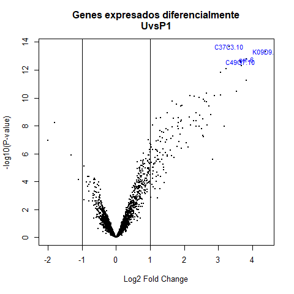
```


```{r volcano4, echo=FALSE, fig.align="center", fig.show="asis", fig.asp=0.5, fig.cap="Volcanoplots para UvsP4. Resaltados aparecen los 4 primeros genes seleccionados", message=FALSE, fig.pos="H"}
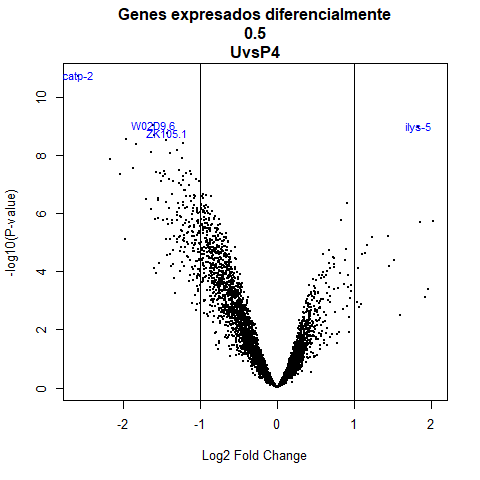
```


  En la Figura \@ref(fig:Venndiagram) Se observa que de la lista de seleccionados, sólo 22 genes son compartidos entre las comparaciones UvsP1 y UvsP4. Un número mucho más elevado es compartido con la comparación PvsPP4, lo que podría indicarnos que una vez ejercido el primer traumatismo, el individuo puede acostumbrarse a la señal de estrés reduciendo las diferencias entre los individuos de edad 1 y edad 4.  
  

```{r Venndiagram, echo=FALSE, fig.cap="Diagrama de Venn que muestra los genes compartidos entre las comparaciones UvsP1", fig.align="center"}
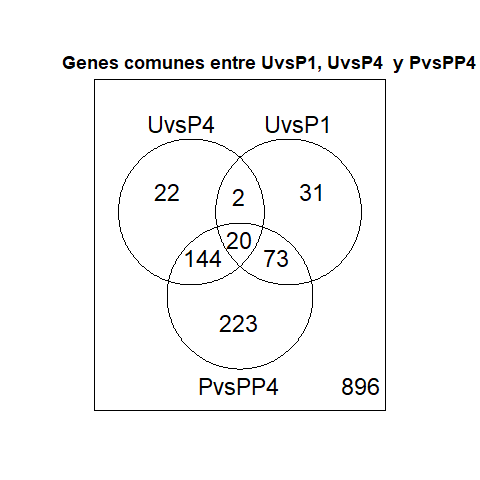
```


 
 En los gráficos resultado de `heatmap`, se observan columnas claramente diferentes para cada uno de los grupos muestrales, tanto en el gráfico sin agrupamiento como en el gráfico con él.  
  
```{r heatmapsin, echo=FALSE, fig.cap="Heatmap para genes expresados diferencialmente sin agrupamiento, para FDR <0,1 y logFC >=1", fig.align="center", fig.pos="H"}
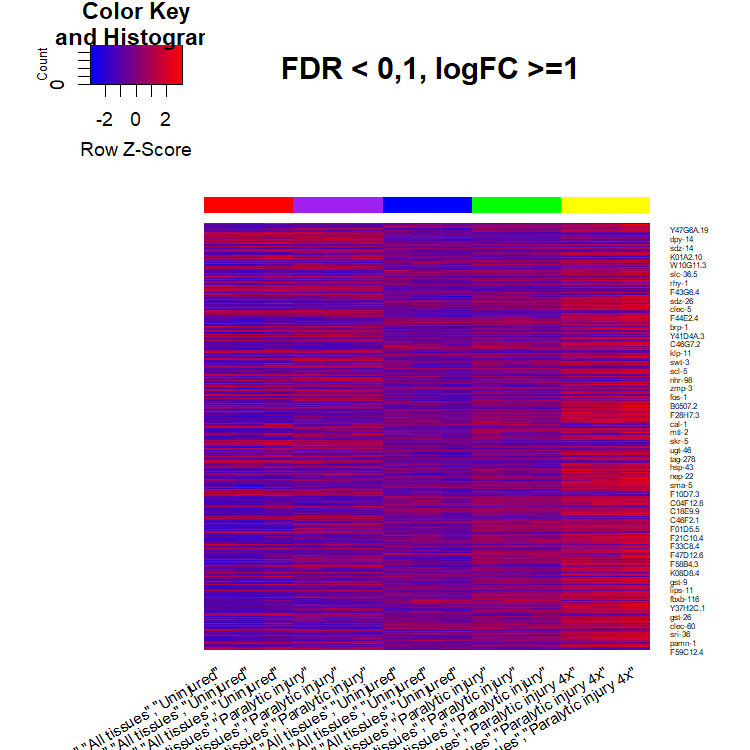
```
```{r heatmapcon, echo=FALSE, fig.cap="Heatmap para genes expresados diferencialmente con agrupamiento, para FDR <0,1 y logFC >=1", fig.align="center", fig.pos="H"}
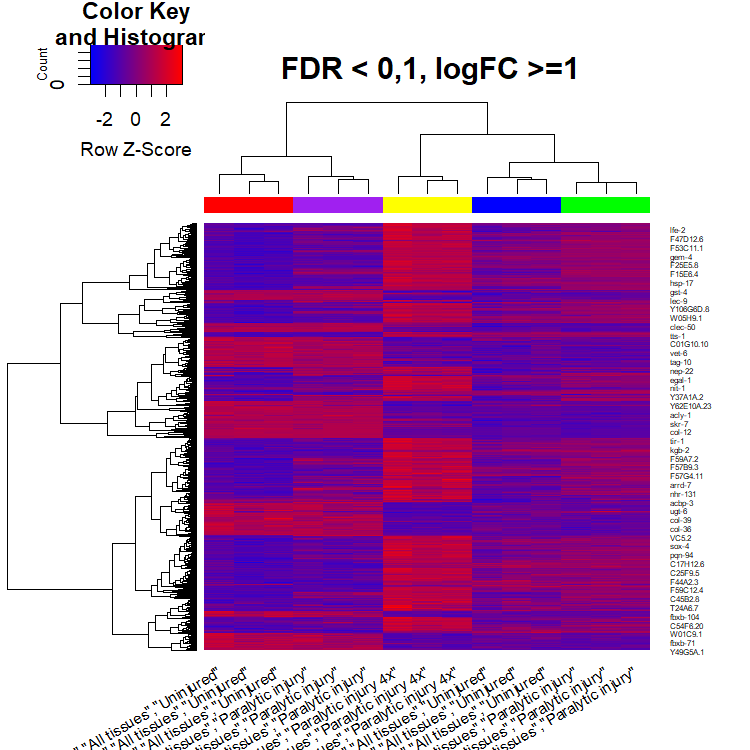
```
 


### Resultados del "Gene Enrichment Analysis"

Los genes selecionados para este análisis en cada una de las comparaciones son:

```{r echo=FALSE}
sapply(listOfSelected, length)
```

Sólo se utilizarán los correspondientes a day1 (UvsP1), day4 (UvsP4) e INT (interacción entre ambos). Para ceñirme al objetivo del estudio, sólo se muestran aquí los resultados del análisis realizado con enrichGO para procesos biológicos (Figuras \@ref(fig:cnetplot) y \@ref(fig:emapplot)). En la Figura \@ref(fig:cnetplot) aparecen cinco procesos biológicos enriquecidos, la respuesta inmune innata, la respuesta inmune, el proceso del sistema inmune, la respuesta de defensa y la respuesta a estímulos bióticos:

```{r cnetplot, fig.cap="Network obtenida mediante el análisis enrichGO en la lista obtenida de la comparación entre UvsP1 y UvsP4"}
cnetplot(ego2, categorySize = "geneNum", schowCategory = 15, 
         vertex.label.cex = 0.55)
```

```{r emapplot, fig.cap="'Enrichment Map' mediante el análisis enrichGO en la lista obtenida de la comparación entre UvsP1 y UvsP4"}
emapplot(ego2, cex.label=0.4)
```


## Sumario de resultados 

```{r}
Tab.react1 <- read.csv2(file.path("./results/BPenrichGO.Results.day1.csv"), 
                       sep = ",", header = TRUE, row.names = 1)
```
```{r}
Tab.react4 <- read.csv2(file.path("./results/BPenrichGO.Results.day4.csv"), 
                       sep = ",", header = TRUE, row.names = 1)
```

Para los individuos de un día de edad, se han encontrado `r nrow(Tab.react1)` procesos biológicos mediante el análisis de "enrichGO", mientras que para los individuos de cuatro días de edad se han encontrado `r nrow(Tab.react4)`. Es interesante observar que, aunque la diferencia en el número de procesos biológicos señalados por el análisis es notable entre ambas comparaciones, los 4 más importantes para ambas comparaciones son los mismos (Cuadros 1 y 2).


```{r tableReacto, echo=FALSE, fig.pos="H"}
library(kableExtra)
Tab.react1 <- Tab.react1[1:4, 1:5]
knitr::kable(Tab.react1, booktabs = TRUE, caption = "Primeras filas y columnas de resultados de enrichGO para la comparación UvsP1")%>%
  kable_styling(latex_options = "hold_position")

```
```{r tableReacto4, echo=FALSE, fig.pos="H"}

Tab.react4 <- Tab.react4[1:4, 1:5]
knitr::kable(Tab.react4, booktabs = TRUE, caption = "Primeras filas y columnas de resultados de enrichGO para la comparación UvsP4")%>%
  kable_styling(latex_options = "hold_position")

```


# Discusión

Los resultados de este informe coinciden con los obtenidos en el experimento original; existen diferencias en las expresiones génicas de individuos de 1 y 4 días de edad, sometidos a un mísmo estímulo de estrés. Tanto el tamaño muestral como el diseño experimental son suficientes para observar diferencias en la expresión génica de los diferentes grupos. Aún así, se recomienda aumentar el número de muestras, principalmente para los grupos 1U, 1P, U4 y 4P. Además, sería conveniente crear el grupo 1P4P, esto es, individuos de 1 día de edad estimulados 4 veces. Así podría estudiarse también la habituación de _C.elegans_ a estímulos de estrés y posibles cambios de la misma respecto a la edad del individuo. 

Por último, se aconseja obtener muestras recogidas en tiempos variables. En el presente estudio, se recogieron las muestras de RNA una hora después de realizar el tratamiento. Si se recogiesen muestras, por ejemplo, 15min, 30min y 45min después del tratamiento, el estudio sería mucho más preciso a la hora de decidir qué rutas son las que efectivamente se han activado por el tratamiento recibido, y no por otras posibles señales que estén recibiendo del medio externo (cambio de temperatura, vibraciones por movimientos en el laboratorio, interacción con otros individuos si los hubiera,...). Además permitiría el estudio del tiempo de reacción de _C.elegans_ desde la recepción del estímulo hasta su respuesta mde modificación de expresión génica.


# Bibliografía

 
 

 
 
 
 